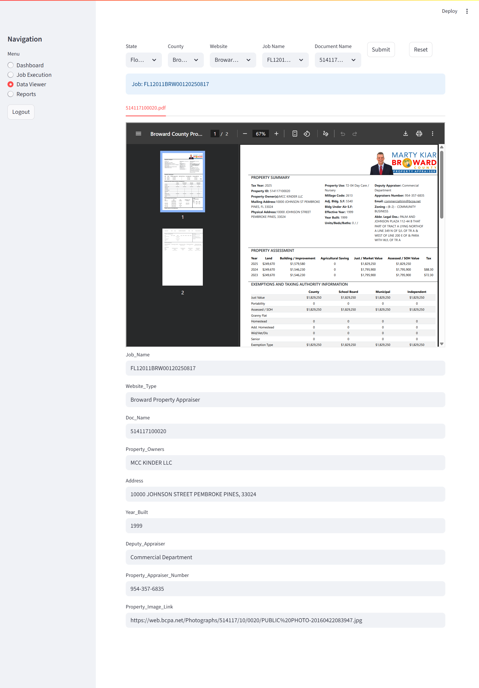

# TitleSearch
End-to-end titlesearch project for users with title needs - encompasses scraping from various websites to ML classification,extraction and transformation of document data as required by the industry.

## Live Flow
 
(Place-holder image. GIF will be added here)

# Setup
1. Clone the repository: `https://github.com/Daremitsu1/TitleSearch.git`
2. cd TitleSearch
3. Build Docker image: `docker build -t titlesearch:latest .`
4. Run container with port mapping: `docker run -p 8001:8001 -p 8002:8002 -p 8501:8501 titlesearch:latest`

# Who, When, Why?
👨🏾‍💻 Author: Aviparna Biswas  
📅 Version: 1.0.0  
📜 License: This project is licensed under the MIT License  